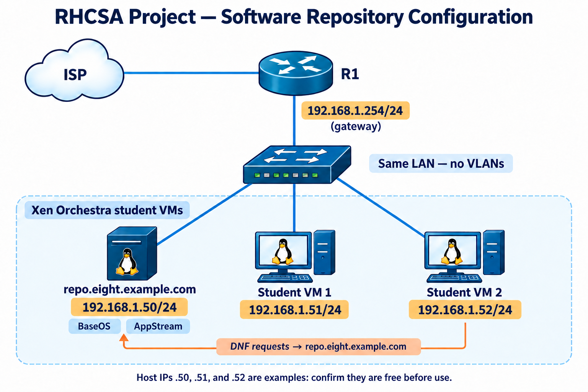
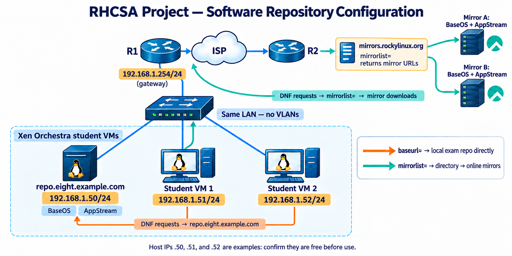
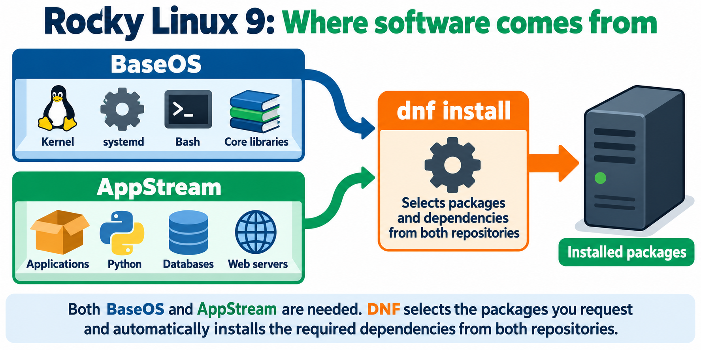

# Linux Project 02: Software Repository Configuration

## RHCSA LAB



## RedHat Exam Question:
Configure the repositories which are available on the repo server at:\
http://repo.eight.example.com/BaseOS \
http://repo.eight.example.com/AppStream

### Explanation:
For the exam/real scenario, the task is to configure access to the specific exam server URLs. On your own VM, check to see if you already have working Rocky repositories, so leave them in place. If you practice adding the exam entries, give them distinct IDs such as [exam-baseos] and [exam-appstream]. The repo.eight.example.com address is intended for the exam network and may not work from your home lab.

## INTRODUCTION
This is a simple problem to solve if you understand what is going on!
Overview Diagram

- Orange path: baseurl= sends DNF directly to your lab server, repo.eight.example.com.
- Teal path: mirrorlist= contacts mirrors.rockylinux.org for server addresses; DNF then downloads packages from an online mirror.
The two mirror servers shown are examples. The mirror list service is the directory, while those servers hold the BaseOS and AppStream packages.

### What is contained in BaseOS and AppStream Repositories?

When we type "dnf install httpd"
1. DNF goes to the configuration file(s), for example, rocky.repo [address book]
2. This points to either mirrolist or baseurl servers holding the packages 

## Scope of Work
# BaseOS and AppStream in Rocky Linux 9
[Official Red Hat documentation: Repositories in RHEL 9](https://docs.redhat.com/en/documentation/red_hat_enterprise_linux/9/html/considerations_in_adopting_rhel_9/ref_repositories_considerations-in-adopting-rhel-9)

On your **Rocky Linux 9** VM, BaseOS and AppStream are software repositories: collections of packages that `dnf` can download and update.

| Repository | What it provides | Think of it as |
|---|---|---|
| **BaseOS** | Core operating system components, such as the kernel and essential system tools | The foundation of the house |
| **AppStream** | Additional applications, programming languages, runtimes, and databases | The tools and services you put in the house |

Both are normal parts of Rocky Linux. When you run `dnf install`, DNF checks the enabled repositories and downloads the requested package and its required dependencies.

To see the enabled repositories on your VM:

```bash
dnf repolist

> Simplified Flow Diagram
.png>)

## STEP-1: How do we find the list of repositories (repo) in our linux VM (Virtual Machine)?
```bash
[root@nitacademy ~]# dnf repolist
repo id                                                repo name
appstream                                              Rocky Linux 9 - AppStream
baseos                                                 Rocky Linux 9 - BaseOS
docker-ce-stable                                       Docker CE Stable - x86_64
extras                                                 Rocky Linux 9 - Extras
```
## STEP-2: How do you check the STATUS of each repository
dnf repolist --all tells you which repository entries exist.
```bash
[root@nitacademy ~]# dnf repolist --all
repo id                      repo name                                                                        status
appstream                    Rocky Linux 9 - AppStream                                                        enabled
appstream-debuginfo          Rocky Linux 9 - AppStream - Debug                                                disabled
appstream-source             Rocky Linux 9 - AppStream - Source                                               disabled
baseos                       Rocky Linux 9 - BaseOS                                                           enabled
```

## STEP-3  Configuration file - we will know which server addresses those enabled repositories use.

The files in /etc/yum.repos.d/ 
```bash
[root@nitacademy ~]# cd /etc/yum.repos.d/
[root@nitacademy yum.repos.d]# pwd
/etc/yum.repos.d
[root@nitacademy yum.repos.d]# ll
total 28
-rw-r--r--. 1 root root  811 May 16 22:01 docker-ce.repo
-rw-r--r--. 1 root root 6610 May  8 12:31 rocky-addons.repo
-rw-r--r--. 1 root root 1165 May  8 12:31 rocky-devel.repo
-rw-r--r--. 1 root root 2387 May  8 12:31 rocky-extras.repo
-rw-r--r--. 1 root root 3417 May  8 12:31 rocky.repo
-rw-r--r--. 1 root root 1425 May  8 12:31 rocky-security.repo
```

> Remember any new file created must always end in .repo 
> Configuration file => /etc/yum.repos.d/rocky.repo tells DNF where to find software.
```shell
[root@nitacademy yum.repos.d]# cat rocky.repo
# rocky.repo
#
# The mirrorlist system uses the connecting IP address of the client and the
# update status of each mirror to pick current mirrors that are geographically
# close to the client.  You should use this for Rocky updates unless you are
# manually picking other mirrors.
#
# If the mirrorlist does not work for you, you can try the commented out
# baseurl line instead.

[baseos]
name=Rocky Linux $releasever - BaseOS
mirrorlist=https://mirrors.rockylinux.org/mirrorlist?arch=$basearch&repo=BaseOS-$releasever$rltype
#baseurl=http://dl.rockylinux.org/$contentdir/$releasever/BaseOS/$basearch/os/
gpgcheck=1
enabled=1
countme=1
metadata_expire=6h
gpgkey=file:///etc/pki/rpm-gpg/RPM-GPG-KEY-Rocky-9

[baseos-debuginfo]
name=Rocky Linux $releasever - BaseOS - Debug
mirrorlist=https://mirrors.rockylinux.org/mirrorlist?arch=$basearch&repo=BaseOS-$releasever-debug$rltype
#baseurl=http://dl.rockylinux.org/$contentdir/$releasever/BaseOS/$basearch/debug/tree/
gpgcheck=1
enabled=0
metadata_expire=6h
gpgkey=file:///etc/pki/rpm-gpg/RPM-GPG-KEY-Rocky-9

[baseos-source]
name=Rocky Linux $releasever - BaseOS - Source
mirrorlist=https://mirrors.rockylinux.org/mirrorlist?arch=source&repo=BaseOS-$releasever-source$rltype
#baseurl=http://dl.rockylinux.org/$contentdir/$releasever/BaseOS/source/tree/
gpgcheck=1
enabled=0
metadata_expire=6h
gpgkey=file:///etc/pki/rpm-gpg/RPM-GPG-KEY-Rocky-9

[appstream]
name=Rocky Linux $releasever - AppStream
mirrorlist=https://mirrors.rockylinux.org/mirrorlist?arch=$basearch&repo=AppStream-$releasever$rltype
#baseurl=http://dl.rockylinux.org/$contentdir/$releasever/AppStream/$basearch/os/
gpgcheck=1
enabled=1
countme=1
metadata_expire=6h
gpgkey=file:///etc/pki/rpm-gpg/RPM-GPG-KEY-Rocky-9

[appstream-debuginfo]
name=Rocky Linux $releasever - AppStream - Debug
mirrorlist=https://mirrors.rockylinux.org/mirrorlist?arch=$basearch&repo=AppStream-$releasever-debug$rltype
#baseurl=http://dl.rockylinux.org/$contentdir/$releasever/AppStream/$basearch/debug/tree/
gpgcheck=1
enabled=0
metadata_expire=6h
gpgkey=file:///etc/pki/rpm-gpg/RPM-GPG-KEY-Rocky-9

[appstream-source]
name=Rocky Linux $releasever - AppStream - Source
mirrorlist=https://mirrors.rockylinux.org/mirrorlist?arch=source&repo=AppStream-$releasever-source$rltype
#baseurl=http://dl.rockylinux.org/$contentdir/$releasever/AppStream/source/tree/
gpgcheck=1
enabled=0
metadata_expire=6h
gpgkey=file:///etc/pki/rpm-gpg/RPM-GPG-KEY-Rocky-9
```
### Configuration file Explained
We need to understand the following Terminologies:
1. mirrorlist: this gives DNF addresses of available download servers.
   - Mirror servers: hold the BaseOS and AppStream package catalogs and RPM files.
2. baseurl: this is the direct address to a server within a network
3. gpgcheck: This tells DNF to verify the digital signature on each RPM Package before installing it.
   - gpgcheck=1 means check is on;
   - gpgcheck=0 means check is off (IF no key. In the exam this select gpgcheck=0)
4. gpgkey
   - This tells DNF to find Rocky's Public Key for that verification
   - file:// means the key file is in the localhost. /etc/pki/rpm-gpg
5. enabled: Use or not to use this repository
   - enabled=0
   - enabled=1
```shell
Note:
- DNF: compares those catalogs with what your VM has installed, then downloads and installs needed updates.
- Important Note: An exam question not mentioning a key does not by itself prove that gpgcheck=0 is required. A suitable key might already be  installed. In a practice lab, gpgcheck=0 is commonly used to keep the exercise focused on configuring the two URLs. For a real repository, keep signature checking on and configure the correct key whenever signed packages and that key are available.
```

| Line | Summary Descriptions|
|---|---|
| `[baseos]` | This section’s **repository ID** is `baseos`. That is the ID shown by `dnf repolist`. |
| `name=...` | A readable name for people. `$releasever` is filled in by DNF; on this Rocky 9 system, it displays as `9`. |
| `mirrorlist=...` | Ask Rocky’s mirror service for a list of servers that carry BaseOS packages. The mirror list is **not itself the package warehouse**; it gives DNF warehouse addresses. |
| `#baseurl=...` | An alternative direct address. The `#` means it is **currently inactive**. DNF is using `mirrorlist`, not this `baseurl`. |
| `gpgcheck=1` | Check downloaded RPM packages against a trusted cryptographic signature before installing them. `1` means on. |
| `enabled=1` | DNF is allowed to use this repository. This is why `baseos` appears in `dnf repolist`. |
| `countme=1` | Allows Rocky to estimate how many systems use its mirrors during normal DNF requests. It does not install anything. |
| `metadata_expire=6h` | After six hours, DNF checks whether its cached **package catalog** needs updating. It does not mean installed packages expire after six hours. |
| `gpgkey=file:///...` | The location of Rocky’s public signing key **on your VM**. DNF uses it for the signature check. `file://` means a local file, not a web address. |


```shell
NOTES:
- Reference: [DNF configuration reference](https://dnf.readthedocs.io/en/latest/conf_ref.html).
- In the mirror URL, `$basearch` means your system’s architecture, such as `x86_64`; `$releasever` identifies the release. `$rltype` is a Rocky specific value used when forming the requested repository name. **DNF substitutes these values** before contacting the mirror service—you do not type replacements into this file yourself.
```

Whether they are additional repositories depends on what is already configured:
- If your VM has no working BaseOS and AppStream entries, this file supplies them.
- If it already has entries for them, you are pointing DNF to another source for the same kinds of packages. You should avoid reusing the same repository IDs ([baseos] and [appstream]) in two files.
For the exam, a safe way to distinguish the supplied sources is to name their IDs [exam-baseos] and [exam-appstream]. The IDs can be your own names; the baseurl values must match the addresses in the question exactly.


```
## REDHAT EXAM QUESTION
Configure the repositories which are available on the repo server at:
http://repo.eight.example.com/BaseOS
http://repo.eight.example.com/AppStream

## Let us understand the Question
The exam task asks you to configure two DNF repositories using the exact URLs shown. 

## What you do on the exam VM
1. Create a file that tells DNF the two addresses:
```bash
vi /etc/yum.repos.d/eight.repo
```
Press i to enter insert mode, then type:
```bash
[baseos]
name=BaseOS
baseurl=http://repo.eight.example.com/BaseOS
enabled=1
gpgcheck=0

[appstream]
name=AppStream
baseurl=http://repo.eight.example.com/AppStream
enabled=1
gpgcheck=0
```
The file `/etc/yum.repos.d/rocky.repo` tells DNF where to find Rocky Linux software. This handout focuses on the two enabled repositories, **BaseOS** and **AppStream**.

**Teaching analogy:** The repository holds the software packages. The `.repo` file holds the directions to that repository.

### First, the lines beginning with `#`

```ini
# rocky.repo
# The mirrorlist system uses ...
```

A `#` makes a line a **comment**. DNF ignores it. The opening comments explain why Rocky normally uses a mirror list: it can direct your VM to an available Rocky download server near you.

### The enabled BaseOS section

```ini
[baseos]
name=Rocky Linux $releasever - BaseOS
mirrorlist=https://mirrors.rockylinux.org/mirrorlist?arch=$basearch&repo=BaseOS-$releasever$rltype
#baseurl=http://dl.rockylinux.org/$contentdir/$releasever/BaseOS/$basearch/os/
gpgcheck=1
enabled=1
countme=1
metadata_expire=6h
gpgkey=file:///etc/pki/rpm-gpg/RPM-GPG-KEY-Rocky-9
```


### The enabled AppStream section

```ini
[appstream]
name=Rocky Linux $releasever - AppStream
mirrorlist=https://mirrors.rockylinux.org/mirrorlist?arch=$basearch&repo=AppStream-$releasever$rltype
#baseurl=http://dl.rockylinux.org/$contentdir/$releasever/AppStream/$basearch/os/
gpgcheck=1
enabled=1
countme=1
metadata_expire=6h
gpgkey=file:///etc/pki/rpm-gpg/RPM-GPG-KEY-Rocky-9
```

It uses **the same settings in the same way**. The key differences are its ID, `[appstream]`, and its URLs, which request **AppStream** rather than **BaseOS** packages. Both are enabled, so DNF can use both when resolving an installation.

### How this relates to your exam question

Your VM currently says, in effect: **“Ask Rocky’s mirror service where to get BaseOS and AppStream.”**

The exam question says: **“Configure DNF to get them from these exact addresses on `repo.eight.example.com`.”** That is why the exam solution uses `baseurl=`: the question provides **direct repository addresses**, so there is no mirror list to ask.

**Note about the other sections:** `baseos-debuginfo`, `baseos-source`, `appstream-debuginfo`, and `appstream-source` are separate repositories for debugging information or source code. Each has `enabled=0`, so DNF does not normally use them.


## 1. Exam Task Converted to a Project

Configure BaseOS and AppStream repositories. The sample URLs are `http://repo.eight.example.com/BaseOS` and `http://repo.eight.example.com/AppStream`.

## 2. Business Scenario

NexusVentures installs software only from approved repositories. Students will define repository metadata, verify package availability, and install Apache for the next project.

## 3. Learning Outcomes

Students will plan the change, record the original state, implement the configuration, explain each command, validate the result, test reboot persistence where applicable, and document rollback.

## 4. Safety and Prerequisites

- Confirm the assigned VM with `hostnamectl` and `ip -brief address`.
- Confirm the account with `whoami`; expected output is `root`.
- Create a Xen Orchestra snapshot before disruptive work.
- Save pre-change evidence under `/root/nexusventures-project02/`.


## 5. Step-by-Step Solution

### Step 1: Obtain reachable URLs

```bash
BASEOS_URL="http://repo.eight.example.com/BaseOS"
APPSTREAM_URL="http://repo.eight.example.com/AppStream"
```

Use instructor-provided URLs. The sample names work only when the lab provides matching DNS and web content.

### Step 2: Record current repositories

```bash
mkdir -p /root/nexusventures-project02/evidence
dnf repolist all > /root/nexusventures-project02/evidence/repolist-before.txt
```

### Step 3: Test the locations

```bash
curl -I --max-time 10 "$BASEOS_URL/"
curl -I --max-time 10 "$APPSTREAM_URL/"
```

### Step 4: Back up and create the repository file

```bash
[ ! -f /etc/yum.repos.d/nexusventures.repo ] ||   cp -a /etc/yum.repos.d/nexusventures.repo   /root/nexusventures-project02/nexusventures.repo.before

cat > /etc/yum.repos.d/nexusventures.repo <<EOF
[nexus-baseos]
name=NexusVentures BaseOS
baseurl=${BASEOS_URL}
enabled=1
gpgcheck=0

[nexus-appstream]
name=NexusVentures AppStream
baseurl=${APPSTREAM_URL}
enabled=1
gpgcheck=0
EOF
```

`gpgcheck=0` matches the isolated exam-style lab. Production repositories should use trusted signatures and keys.

### Step 5: Refresh only these repositories

```bash
dnf clean all
dnf makecache --disablerepo='*'   --enablerepo=nexus-baseos,nexus-appstream

dnf repolist --disablerepo='*'   --enablerepo=nexus-baseos,nexus-appstream
```

### Step 6: Confirm and install Apache

```bash
dnf info httpd --disablerepo='*'   --enablerepo=nexus-baseos,nexus-appstream

dnf install -y httpd --disablerepo='*'   --enablerepo=nexus-baseos,nexus-appstream
rpm -q httpd
```

Do not start Apache until Project 03.

## 6. Required Validation

```bash
dnf makecache --disablerepo='*' --enablerepo=nexus-baseos,nexus-appstream
dnf repolist --disablerepo='*' --enablerepo=nexus-baseos,nexus-appstream
rpm -q httpd
```

## 7. Evidence Students Must Submit

Submit the `.repo` file, URL tests, `dnf repolist`, metadata refresh, and Apache package version. Explain repository IDs, `enabled`, `baseurl`, and `gpgcheck`.

## 8. Rollback or Cleanup

```bash
rm -f /etc/yum.repos.d/nexusventures.repo
dnf clean all
```
Restore the backed-up file if one existed.

## 9. Completion Checklist

- [ ] Correct VM confirmed
- [ ] Snapshot created when required
- [ ] Original state recorded
- [ ] Configuration completed
- [ ] Validation passed
- [ ] SELinux remains enforcing
- [ ] firewalld remains enabled
- [ ] Reboot persistence tested when required
- [ ] Evidence collected
- [ ] Rollback understood

## 10. Review Questions

1. What business problem did this project solve?
2. Which command proved the configuration was active?
3. Which command proved it was persistent?
4. What could fail, and how would you roll back?
